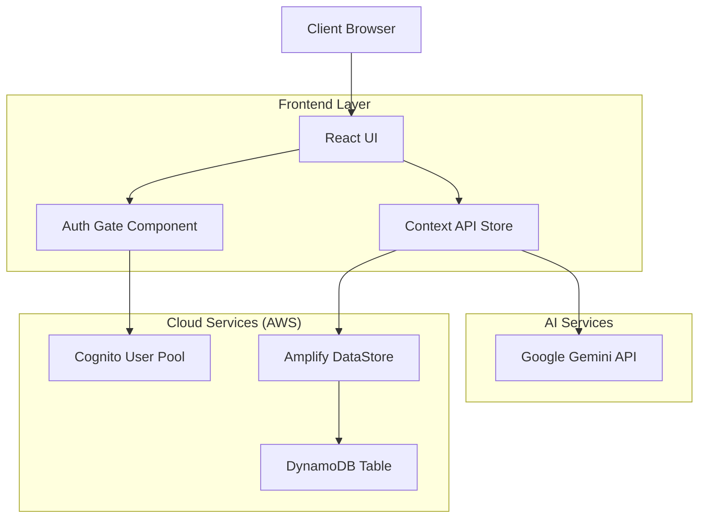

# Design Document: BINGO - Intelligent BOQ Management System

## 1. Executive Summary

**BINGO** (Bill of Quantities Generator) is an enterprise-grade web application designed to revolutionize the construction and engineering estimation process. By integrating advanced Generative AI (Google Gemini) with a robust, cloud-native architecture (AWS Amplify), BINGO automates the complex task of creating detailed Bill of Quantities (BOQ).

The system addresses the critical industry challenge of manual estimation errors and time-consuming data entry. It provides a seamless workflow for project managers, engineers, and quantity surveyors to generate, validate, and export precise component lists and pricing models, significantly reducing proposal turnaround times and increasing accuracy.

## 2. System Overview

### 2.1. Purpose
The primary objective of BINGO is to facilitate the rapid creation of standardized BOQ documents based on room parameters (e.g., dimensions, capacity, usage type). It bridges the gap between high-level project requirements and granular equipment lists.

### 2.2. Scope
The application encompasses:
- **Project Management**: Centralized dashboard for tracking multiple client projects.
- **Intelligent Estimation**: AI-driven suggestions for equipment based on room context (e.g., extracting "Video Conferencing" needs for a "Boardroom").
- **Data Persistence**: Cloud storage for all project data, ensuring accessibility and security.
- **Export Capabilities**: Generation of industry-standard Excel (.xlsx) files for sharing with clients and stakeholders.

## 3. User Personas

### 3.1. The Administrator (System Overseer)
*   **Profile**: IT Manager or Lead System Architect.
*   **Responsibilities**:
    *   **User Lifecycle Management**: Provisioning accounts, assigning roles (Admin/User), and handling revocations.
    *   **Security Monitoring**: Reviewing audit logs for suspicious activities or compliance violations.
    *   **System Configuration**: Ensuring global settings and API quotas are maintained.

### 3.2. The Quantity Surveyor / Engineer (End User)
*   **Profile**: Estimation Engineer or Project Manager.
*   **Responsibilities**:
    *   **Data Entry**: Inputting precise client details and room specifications.
    *   **Prompt Engineering**: Guiding the AI to generate relevant equipment lists.
    *   **Validation**: Reviewing AI suggestions against real-world catalogue prices and modifying margins.
    *   **Reporting**: Delivering final BOQ documents to sales teams or clients.

## 4. Detailed Functional Requirements

### 4.1. Authentication & Security
*   **Requirement**: Secure, role-based access to the platform.
*   **Implementation**: Integration with Amazon Cognito for identity management.
    *   *MFA Support*: Ready infrastructure for Multi-Factor Authentication.
    *   *Session Management*: Auto-logout and secure token handling.
    *   *Role Enforcement*: Strict "Admin-only" routes for user management.

### 4.2. Project & Room Management
*   **Requirement**: Hierarchical organization of data (Client -> Project -> Room).
*   **Implementation**:
    *   **Dashboard**: A high-density data grid displaying active projects.
    *   **Room Templates**: Pre-configured templates (e.g., "Huddle Room", "Auditorium") to speed up data entry.
    *   **Contextual Awareness**: The system remembers the project context (Client Name, Location) for all generated documents.

### 4.3. AI-Driven BOQ Engine
*   **Requirement**: Convert unstructured room parameters into structured line items.
*   **Implementation**:
    *   **Input Analysis**: Consumes Room Name, Description, Capacity, and Display Type.
    *   **Generative Processing**: Queries Google Gemini Pro Vision (multimodal-ready) to infer necessary equipment.
    *   **Structured Output**: Returns JSON-formatted data including Category, Description, Unit Price, and Quantity.

### 4.4. Financial Modeling & Export
*   **Requirement**: Accurate pricing and professional output formats.
*   **Implementation**:
    *   **Pricing Engine**: Allows manual override of Unit Prices and Quantities. Calculates Totals and Margins dynamically.
    *   **Excel Export**: Uses `exceljs` to generate formatted spreadsheets with headers, formulas, and branding.

## 5. User Experience (UX) Design

### 5.1. Design Philosophy
*   **Professional Minimalism**: The interface uses a clean, data-first aesthetic suitable for engineering environments.
*   **Direct Manipulation**: Users edit data directly in place (tables/grids) rather than navigating through endless wizards.
*   **Feedback Loops**: Immediate visual feedback for system states (Loading, Saving, Generating, Error).

### 5.2. Core Workflows
1.  **Login**: Secure entry point.
2.  **Dashboard**: Operations center.
3.  **Room Configuration**: Input technical requirements.
4.  **Generation**: The "Magic" moment where AI populates the grid.
5.  **Refinement**: Human-in-the-loop validation of AI assumptions.
6.  **Export**: Delivery of value.

## 6. System Architecture

### 6.1. High-Level Diagram

### 6.2. Key Technical Decisions
*   **React & Vite**: Chosen for performance and component reusability.
*   **AWS Amplify**: Selected for rapid backend development and seamless offline synchronization capabilities.
*   **Google Gemini**: Utilized for its superior context window and reasoning capabilities regarding physical world objects (hardware).

## 7. Future Roadmap
*   **Phase 2**: Integration with live vendor pricing APIs.
*   **Phase 3**: Collaborative editing (Multi-user rooms).
*   **Phase 4**: Historical data analysis for improved cost prediction.
