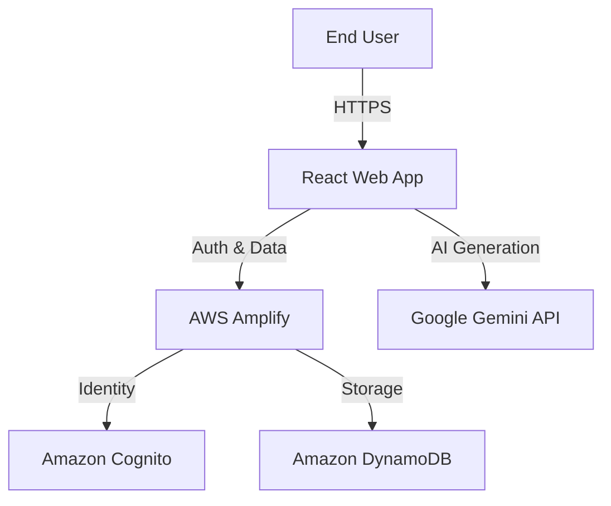

# design document: BINGO - AI-Powered BOQ Management System

## 1. Executive Summary
BINGO is a modern, web-based application designed to streamline the creation of Bill of Quantities (BOQ) for engineering and construction projects. By leveraging the power of Generative AI (Google Gemini) and a robust user management system, BINGO allows professionals to rapidly generate, edit, and export detailed component lists and pricing estimates. It replaces manual, error-prone spreadsheet processes with an intelligent, automated workflow.

## 2. User Personas

### 2.1. The Administrator
- **Role**: System Overseer & Manager.
- **Responsibilities**:
    - Managing user accounts (creation, suspension, role assignment).
    - Monitoring system security and usage through activity logs.
    - Ensuring data integrity and compliance.
- **Goals**: Prevent unauthorized access and maintain a healthy system environment.

### 2.2. The Engineer / Quantity Surveyor (User)
- **Role**: Daily Operator.
- **Responsibilities**:
    - Configuring project details (client info, room specifications).
    - Generating BOQs using AI assistance.
    - Validating and refining generated data (pricing, brands, models).
    - Exporting final documents for clients.
- **Goals**: Produce accurate BOQs quickly to improve proposal turnaround time.

## 3. User Stories & Core Workflows

### 3.1. Authentication & Access
- **As a User**, I want to log in securely so that my work is saved and attributed to me.
- **As an Admin**, I want to control who has access so that confidential project data is protected.
- **Flow**: User enters credentials -> System validates against Cognito & Database -> Access Granted (if Active).

### 3.2. Project Setup ("The Room")
- **As a User**, I want to define specific parameters for a "Room" (e.g., Conference Room, Auditorium) so the AI understands the context.
- **Flow**: Dashboard -> "Add Room" -> Select Template (or Custom) -> Input Dimensions/Capacity -> Save.

### 3.3. AI-Assisted BOQ Generation
- **As a User**, I want the system to suggest a list of necessary equipment based on my room details so I don't miss critical items.
- **Flow**: Open Room -> Click "Generate BOQ" -> AI Analyzes Inputs -> Populates Item List (Screens, Audio, Cables, etc.).

### 3.4. Refining & Exporting
- **As a User**, I want to manually adjust prices and quantities and then export to Excel so I can present it to a client.
- **Flow**: Review Items -> Edit "Unit Price" / "Quantity" -> Click "Export Excel" -> Download .xlsx file.

## 4. High-Level Architecture

### 4.1. Frontend Information Architecture
- **Dashboard**: Central hub showing recent projects and quick actions.
- **Room Interface**: specialized view for individual BOQ editing.
- **Admin Panel**: Restricted area for user and log management.

### 4.2. System Context

## 5. User Experience (UX) Principles
- **Efficiency**: Minimize clicks to generate a full BOQ.
- **Clarity**: Use clear visual distinction between AI-suggested values and confirmed values.
- **Responsiveness**: Ensure the interface works smoothly on tablets and desktops for on-site usage.
- **Professionalism**: The UI reflects a high-end engineering tool (clean lines, data-focused layout).
